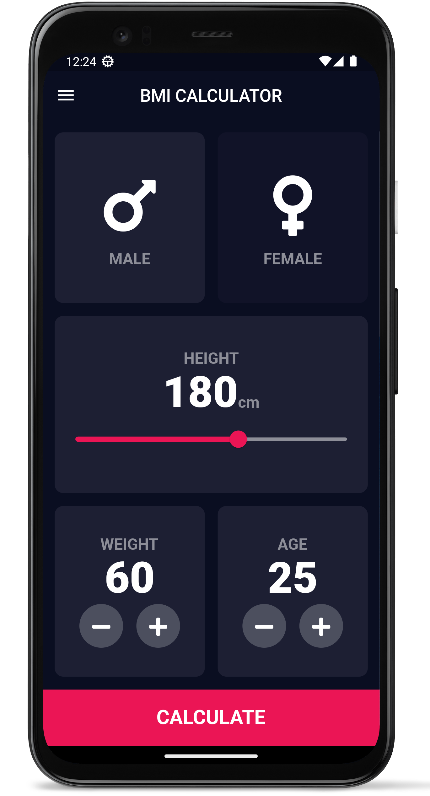
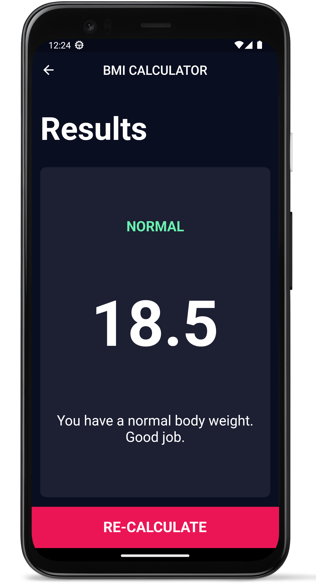

# BMI Calculator


The BMI Calculator app is a simple and elegant mobile application designed to help users calculate their Body Mass Index (BMI) and track their fitness goals. It provides an intuitive user interface, allowing users to input their height and weight to obtain their BMI value and corresponding weight status.

## Features

- Calculate BMI: Enter your height and weight to calculate your BMI.
- Weight Status: Get instant feedback on your weight status based on your calculated BMI.
- Beautiful Design: Enjoy a visually pleasing and user-friendly design for a delightful user experience.

## Screenshots

<div style="display: flex; justify-content: center; align-items: center;">
  

  
</div>

## Getting Started

### Prerequisites

- Flutter SDK: [Installation Guide](https://flutter.dev/docs/get-started/install)

### Installation

1. Clone the repository:

    ```shell
    git clone https://github.com/Endeavor36/bmi_calculator.git

2. Navigate to the project directory:

    ```shell
    cd bmi_calculator

3. Install the dependencies:

    ```shell
    flutter pub get

### Usage

1. Connect your device or emulator.
2. Run the app.

    ```shell
    flutter run

This will start the BMI Calculator on your connected device or emulator. You can now explore the app's features and functionality.

## Contributions

Contributions are welcome! If you have any ideas, suggestions, or bug reports, please open an issue or submit a pull request. For major changes, please open an issue first to discuss your proposed changes.